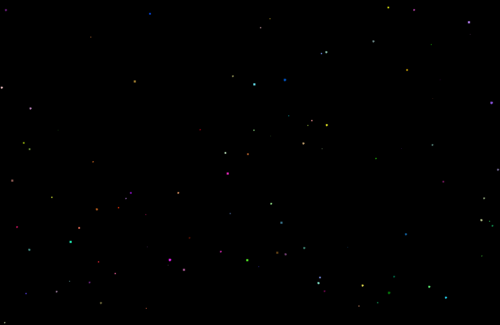

# Gravity Simulation Golang
## Go with [Simple Direct Layer](https://github.com/veandco/go-sdl2)

---

This is a basic implementation of a particle simulation with gravity. The simulation is crude and mildly inefficient but works as a proof of concept. Some basic interaction is implemented using the keyboard, and the use of SDL2 should make this application portable to almost any device.

---

## Usage

In all cases, use the `-h` flag to get more help on how to use the application.

Note that building the SDL2 library can take a long time - for me it took close to five minutes. This is a one time compilation however, and subsequent runs will not require this lengthy step.

### Running from Source

`go run .`

### Building from Source 

First, build using

`go build .`

Then run the application with

`./gravity_simulation`

## Controls

While the simulation is running you can use the keyboard to control parts of the application. The controls are:

### Movement/Zoom

- W : Move view window up
- A : Move view window left
- S : Move view window down
- D : Move view window right
- Q : Zoom out
- E : Zoom in

### Time Scale and Movement Scale

- ArrowKeyDown : Decrease the rate of view window movement
- ArrowKeyUp : Increase the rate of view window movement
- ArrowKeyLeft : Decrease the speed of the simulation
- ArrowKeyRight : Increase the speed of the simulation

### Meta Controls

- Spacebar : Toggle pause/resume
- X : Toggle particle trails
- C : Advance a single timestep (without unpausing)
- P : Print the current state of the simulation (all bodies + settings)
- O : Save the currect state of the simulation

### Changes in this fork
Multithreading
Non-idiotic sleep (sleep REMAINING frame time!)
